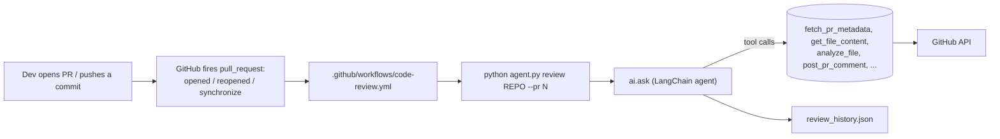

# Code Review Agent

Autonomous GitHub PR reviewer built on **LangChain / LangGraph** +
**ASI:One** (long-form `PROMPT.md`, structured output via `ToolStrategy`,
streaming tool events via `runtime.stream_writer`).

Install the workflow once and every PR is auto-reviewed — on open, on reopen,
and on every new commit (CodeRabbit-style). It posts comments. **It never
merges.**



## Architecture

```
code review/
├── agent.py                              # entry point: review (CLI) + chat (REPL)
├── ai/                                   # LangChain/LangGraph layer
│   ├── __init__.py                       # exports ask + setup_ai_instance
│   ├── PROMPT.md                         # long-form system prompt
│   ├── models.py                         # UserContext, Response, tool I/O
│   ├── tools.py                          # @tool fetch / analyze / post / history
│   └── ai.py                             # create_agent + InMemorySaver + ToolStrategy
├── services/                             # deterministic helpers
│   ├── code_analyzer_service.py          # static checks (Python / JS / TS)
│   └── review_tracker_service.py         # JSON history
├── config/sources.py                     # languages + rules
└── .github/workflows/
    ├── code-review.yml                   # template for ANY repo
    └── self-review.yml                   # this repo's PRs
```

## How it actually works

The agent does not run a fixed pipeline. The LLM is given:

1. The contents of [`ai/PROMPT.md`](ai/PROMPT.md) as its system message — this
   defines the playbook (read PR, analyze, synthesize, post comments,
   record).
2. A toolbox of LangChain `@tool` functions (in [`ai/tools.py`](ai/tools.py)):
   `fetch_pr_metadata`, `fetch_repo_files`, `get_file_content`,
   `analyze_file`, `post_pr_comment`, `record_review`, `list_review_history`.
3. A typed user context (`ai/models.py::UserContext`) carrying
   `github_token` and `dry_run` per session.
4. A required structured output schema (`Response`) — every turn ends with
   `text`, optional `pr_url`, `issues_count`, `posted_comments`.

When asked to review a PR, the LLM autonomously walks through:
`fetch_pr_metadata` → `get_file_content` (per file) → `analyze_file` (per
file) → synthesize markdown review → `post_pr_comment` (top-level summary
plus up to 10 line-anchored notes) → `record_review`.

Every tool emits `runtime.stream_writer("Doing X...")` updates, which the
CLI and chat REPL surface to the user so they see live progress.

## Quick start (local)

```bash
# 1. Install deps (uses uv)
pip install uv
uv sync

# 2. Configure
cp .env.example .env
# edit .env: set ASI_ONE_API_KEY (and GITHUB_TOKEN to actually post)

# 3a. CLI review mode — one review and exit
uv run python agent.py review microsoft/autogen --pr 500 --dry-run
uv run python agent.py review microsoft/autogen --pr 500     # actually posts

# 3b. Interactive chat mode (REPL)
uv run python agent.py chat
# then type, e.g.:
#     review microsoft/autogen #500
#     history
#     review torvalds/linux             # branch review (no posting)
```

`--dry-run` (or `DRY_RUN=true` in `.env`) makes `post_pr_comment` a no-op —
the agent still produces the full review and prints it to stdout / chat.

## Custom prompts: just edit `ai/PROMPT.md`

This is the whole point of this architecture — the playbook lives in plain
markdown. Want stricter security focus? Open
[`ai/PROMPT.md`](ai/PROMPT.md) and rewrite it. No code change required, no
restart for chat mode after changing the file (in CLI mode the file is
re-read on each invocation).

You can also adjust:

- The list of static checks → [`services/code_analyzer_service.py`](services/code_analyzer_service.py)
- File extensions / caps → [`config/sources.py`](config/sources.py)
- The structured response shape → [`ai/models.py`](ai/models.py) `Response` class

## Auto-review every PR (CI flow)

1. **Push this repo to GitHub** (e.g. `youruser/code-review-agent`).
2. **In the target repo** you want reviewed:
   - Copy [`.github/workflows/code-review.yml`](.github/workflows/code-review.yml)
     into the target repo at the same path.
   - Replace `YOUR_GH_USER/code-review-agent` with the path you pushed to.
   - In **Settings → Secrets and variables → Actions**, add the secret
     `ASI_ONE_API_KEY` = your ASI:One key. (No reviewer variable needed.)
3. **Open a PR** in the target repo. GitHub fires
   `pull_request: opened` and the agent runs automatically — no need to add
   it as a reviewer. Within ~1-2 minutes you'll see comments on the PR.
   Every new commit you push (`synchronize`) and any reopen triggers a fresh
   review of the latest code.

A `concurrency` group cancels an in-flight review when a newer commit lands,
so rapid pushes don't pile up duplicate runs.

> **Fork PRs:** GitHub does not expose repo secrets to workflows triggered by
> PRs from forks, so `ASI_ONE_API_KEY` won't be available there. Auto-review
> works for branches pushed to the same repo; for fork contributions, run the
> review manually with `python agent.py review owner/repo --pr N`.

## Configuration

### Environment variables

| Variable | Required | Purpose |
| --- | --- | --- |
| `ASI_ONE_API_KEY` | yes | ASI:One key. `ChatOpenAI` is pointed at `https://api.asi1.ai/v1`. |
| `ASI_ONE_MODEL` | no | Defaults to `asi1`. |
| `GITHUB_TOKEN` | yes (to post) | PAT or auto-injected `secrets.GITHUB_TOKEN` in Actions. |
| `DRY_RUN` | no | `true` skips comment posting. |
| `LOG_LEVEL` | no | `DEBUG`/`INFO`/`WARNING`. |

### `config/sources.py`

- `LANGUAGES_TO_REVIEW` — file extensions the agent will read.
- `REVIEW_RULES` — toggles for python/javascript checks, line length, file/issue caps.

## What it will NEVER do

- Call any GitHub merge endpoint (`/merge`, `/dismiss`, `/approve`).
- Push to branches.
- Create or close issues.
- Resolve review threads from other reviewers.

The only writes any tool can perform are:
- `POST /repos/:o/:r/issues/:n/comments` (the summary + fallbacks)
- `POST /repos/:o/:r/pulls/:n/comments` (line-anchored notes)

This is enforced both by the prompt (`Hard rules`) and by the actual tool
surface — there is no merge tool to call.

## Troubleshooting

| Symptom | Likely cause / fix |
| --- | --- |
| `Missing required env var(s): ASI_ONE_API_KEY` | Set it in `.env` or workflow secrets. |
| Agent runs but never posts | `DRY_RUN=true` is set, or the `dry_run` arg was passed. Set to `false` and re-run. |
| Review didn't run on a fork PR | Repo secrets aren't shared with fork-triggered workflows; run the review manually with `python agent.py review owner/repo --pr N`. |
| Line comments missing, only summary appears | The file/line wasn't part of the PR diff; the tool falls back to a top-level comment automatically. |
| `httpx.ConnectError` to `api.asi1.ai` | Network blocked; verify outbound HTTPS to `api.asi1.ai` and `api.github.com` is allowed. |

## License

MIT
